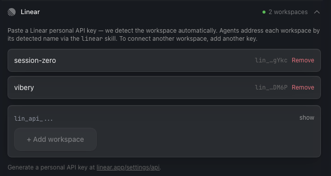

# linmux

> One CLI for Linear across **all** your workspaces — the full GraphQL surface (~500 ops), multiple workspaces in a single session, and stable versioned JSON built for AI agents.

[](https://github.com/ChuckMayo/linear-multi-workspace-cli/actions/workflows/ci.yml)
[](https://www.npmjs.com/package/linmux)
[](./LICENSE)
[](https://nodejs.org/)

`linmux` is a single shell-out CLI for Linear. It registers **as many Linear workspaces as you have** and lets one agent session route any command at any of them, it reaches **every operation in Linear's GraphQL schema** (~500, not a curated handful), and it emits a stable, versioned JSON envelope on every call. No per-workspace server to stand up — if your agent can run a shell command, it can drive Linear.

```bash
npx -y linmux@latest workspace add acme     --token lin_api_...
npx -y linmux@latest workspace add personal --token lin_api_...
npx -y linmux@latest issue list --workspace acme     --team ENG  --json
npx -y linmux@latest issue list --workspace personal --team SIDE --json
```

> **Alpha (v0.1.0).** First public release, solo-maintained. Personal API keys only (no OAuth yet). The JSON envelope (`data.*` paths) is the stable contract; everything else may move. See [Project status](#project-status).

---

## Why this exists

Linear's official MCP server is good, and it works in any MCP-capable agent. Two things it doesn't do — by design — are where `linmux` earns its place:

- **Multiple workspaces in one session.** A Linear personal API key is scoped to a single workspace, and the official MCP authorizes one workspace per connection. To work across three workspaces you stand up three MCP server entries and juggle which is which. `linmux` registers all of them once and resolves a workspace **per command** (`--workspace <name>`), so a single session moves freely between them.
- **The full API surface.** The official MCP exposes a curated subset of operations. `linmux` generates every operation in Linear's vendored GraphQL schema and dispatches it through a `raw` layer — so when you need `IssueBatchCreate` or some field the curated commands don't expose, it's already there.

On top of those two, it's a plain shell-out: versioned JSON for agents to parse without prompting, token-saving flags for high-volume loops, and self-describing schemas so an agent can learn the surface on its own.

| Capability                                   | Official Linear MCP             | `linmux`                              |
| -------------------------------------------- | ------------------------------- | ------------------------------------- |
| Multiple Linear workspaces in one session    | ❌ one workspace per connection | ✅ N workspaces, chosen per command   |
| Full GraphQL surface (~500 ops)              | ⚠️ curated subset               | ✅ every operation, via the raw layer |
| Adding a workspace                           | OAuth + a server entry each     | one `workspace add`, no server to run |
| Transport                                    | MCP server (any MCP client)     | shell-out CLI (any agent that shells) |
| Output for agents                            | MCP structured results          | versioned JSON envelope on stdout     |
| Token-saving / self-discovery flags          | n/a                             | `--no-meta`, `--quiet`, `describe`, `list-tools` |

Honest scope: other community CLIs (e.g. `schpet/linear-cli`) also do multi-workspace. What `linmux` bundles is multi-workspace **plus** the full surface **plus** an agent-stable JSON contract in one shell-out — that combination is the point, not multi-workspace alone.

---

## Quickstart

### Requirements
- Node.js **22** or newer
- A Linear personal API key — generate one at [linear.app/settings/api](https://linear.app/settings/api)

### 1. Register a workspace

```bash
npx -y linmux@latest workspace add acme --token lin_api_...
```

The workspace name is positional (`workspace add <name> --token ...`). The registry is a plain JSON file written with mode `0600` at `$XDG_CONFIG_HOME/linear-agent/config.json` (default `~/.config/linear-agent/config.json`; the directory name predates the rename — see [Project status](#project-status)). Tokens never leave your machine.

### 2. Probe auth

```bash
npx -y linmux@latest whoami --json
```

Returns the resolved viewer + active workspace. Use it as your "did auth work" probe. (`me --json` returns viewer + organization.)

### 3. Use it

```bash
# Curated commands
npx -y linmux@latest issue list --team ENG --json
npx -y linmux@latest issue create --team ENG --title "Fix the thing" --json
npx -y linmux@latest comment create --issue ENG-123 --body "Done." --json

# Any of the ~500 raw GraphQL operations
npx -y linmux@latest describe IssueBatchCreate --json
npx -y linmux@latest raw IssueBatchCreate --vars '{"input":{...}}' --json

# Or an arbitrary GraphQL query
npx -y linmux@latest graphql --query 'query { viewer { id } }' --json
```

Every command supports `--workspace <name>` to target a workspace inline — no `workspace use` required.

---

## The JSON envelope contract

Every command emits a versioned envelope. Pin tests against `data.*` paths, not human prose. The `meta.workspace` field tells you which workspace served the call.

**Success:**
```json
{
  "$apiVersion": "1",
  "ok": true,
  "data": { /* command-specific payload */ },
  "meta": { "command": "issue list", "workspace": "acme" }
}
```

**Failure:**
```json
{
  "$apiVersion": "1",
  "ok": false,
  "error": {
    "code": "VALIDATION_FAILED",
    "message": "Title is required",
    "transient": false,
    "details": { "field": "title" }
  },
  "meta": { "command": "issue create" }
}
```

`ok: true` → exit 0. `ok: false` → exit > 0 (see the error-code taxonomy via `describe`). `error.transient: true` means a retry is appropriate.

Token-saving flags:
- `--no-meta` — drop the `meta` block from success envelopes (~150–250 bytes saved per call)
- `--quiet` — implies `--no-meta` + suppresses pretty banners
- `--retry N` — add N transient-error retries on top of the defaults

---

## Multiple Linear workspaces, one session

Register as many workspaces as you like:

```bash
npx -y linmux@latest workspace add work --token lin_api_...
npx -y linmux@latest workspace add oss  --token lin_api_...
npx -y linmux@latest workspace add side --token lin_api_...
npx -y linmux@latest workspace list --json
```

Then route any command at any workspace per-call:

```bash
npx -y linmux@latest issue list --workspace work --team ENG  --json
npx -y linmux@latest issue list --workspace oss  --team CORE --json
```

Workspace resolution order: `--workspace <name>` flag → `LINEAR_WORKSPACE` env var → registry's active workspace → sole registered workspace → `LINEAR_API_KEY` env var (bypasses the registry entirely; useful in CI).

### In the wild: vibery.gg

[Vibery](https://vibery.gg) — a game where an AI crew does your actual work — drives its whole agent-facing Linear integration through `linmux`. In its Settings, connecting a workspace is just pasting a personal API key: the app probes `viewer { organization }` to validate the key and resolve the one workspace it's scoped to, then registers it under the org's `urlKey` slug. Connecting another workspace is adding another key.



Because the registry is a plain, documented JSON file, Vibery doesn't even shell out `workspace add` — at every agent-session bootstrap it regenerates the file from its own credential store (so removals in Settings actually disappear) under a sandboxed `XDG_CONFIG_HOME` its agent subprocesses inherit. From there any crew agent addresses any workspace by name, per command:

```bash
npx -y linmux@0.1.0 issue list --workspace session-zero --json
npx -y linmux@0.1.0 issue create --workspace vibery --team VIB --title "…" --json
```

The pattern generalizes to any product embedding agents: one pasted key per workspace, auto-detect the name, write the registry (or shell out `workspace add`), and let agents route with `--workspace`. No Linear server-side app, no OAuth flow, no MCP server per workspace.

---

## Agent integrations

### Claude Code (bundled skill)

```bash
npx -y linmux@latest install-skill
```

Copies a Claude Code skill to `~/.claude/skills/linmux/SKILL.md`. The skill tells Claude when to invoke `linmux`, the envelope shape, and the self-discovery commands (`describe`, `list-tools`, `schema`).

### Codex CLI, Gemini CLI, Cursor, anything else

There's no plugin to install — point your agent at the binary:

```bash
# Codex CLI
codex exec "list my open Linear issues using 'npx -y linmux@latest issue list --json'"

# Gemini CLI / Cursor / Copilot CLI / etc. — same pattern: shell out to npx -y linmux@latest <cmd> --json
```

For best results, give your agent a short system prompt: auth lives in `LINEAR_API_KEY` or `linmux workspace add`; pass `--json`; `linmux list-tools --json` enumerates everything; `linmux describe <cmd> --json` returns the Zod-derived input/output schema for any command or raw operation.

---

## Self-discovery

The CLI is introspectable so agents can learn the surface without external docs:

```bash
linmux list-tools --json               # every curated + raw command, one line each
linmux describe issue create --json    # full Zod schema: required/optional flags, output shape, examples
linmux schema --json                   # the entire vendored Linear GraphQL schema (introspection JSON)
```

`describe` is generated from the same Zod schemas that validate flags at runtime, so it's the canonical contract for what a command accepts and returns. Agents should prefer `describe` over reading source.

---

## Architecture

- **Language:** TypeScript, ESM-only, Node 22+
- **CLI framework:** [oclif](https://oclif.io/) (built-in `--json` mode, topic-based command organization)
- **API client:** [`@linear/sdk`](https://www.npmjs.com/package/@linear/sdk) (official, codegen'd from Linear's GraphQL schema)
- **Raw layer:** every operation in Linear's vendored schema is generated as a `TypedDocumentNode` and dispatched via the SDK's `rawRequest` escape hatch
- **Validation:** [Zod 4](https://zod.dev/) for flag parsing AND output schema generation (`describe` reuses the same schemas)
- **Bundling:** [tsdown](https://tsdown.dev/) for fast cold-start (<500 ms median target)
- **Config:** a custom 0600 JSON store (no external config dependency); just workspace names + tokens + an active-workspace pointer

The CLI stores nothing beyond the workspace registry and a single active-workspace pointer. No telemetry, no analytics, no network calls outside the Linear API.

---

## Development

```bash
git clone https://github.com/ChuckMayo/linear-multi-workspace-cli.git
cd linear-multi-workspace-cli
npm install
cp .env.example .env  # add your LINEAR_API_KEY for smoke tests
npm run build
npm test
```

Useful scripts:
- `npm run lint` — Biome lint + format check
- `npm run typecheck` — `tsc --noEmit`
- `npm run codegen` — re-vendor the Linear schema + regenerate the raw operation registry
- `npm run smoke:phase-2` — end-to-end smoke against a real workspace (requires `.env`; **writes to live Linear**)

The vendored Linear schema lives at `schema.graphql`. A weekly GitHub Action (`schema-diff.yml`) detects drift against the live Linear API and opens a sync PR for additive changes.

---

## Project status

**v0.1.0 — alpha, first public release, solo-maintained.** The curated command surface, raw-layer dispatch, JSON envelope contract, multi-workspace registry, and the Claude Code skill bundle are all in place and covered by the test suite.

Known limitations:
- Personal API keys only — no OAuth.
- The on-disk config directory is `~/.config/linear-agent/` (the tool's former name), retained so existing registrations survive the rename. A clean migration to `~/.config/linmux/` is a follow-up.
- Native Windows path defaults (`%APPDATA%`) are out of scope; XDG paths work on Linux/macOS and on Windows shells that set `XDG_CONFIG_HOME`.

---

## Contributing

This repository is **maintained by [@ChuckMayo](https://github.com/ChuckMayo)**. External pull requests are not accepted at this stage — see [CONTRIBUTING.md](./CONTRIBUTING.md) for the rationale and the right way to contribute (issues, discussions, forks).

---

## License

MIT — see [LICENSE](./LICENSE).
